# Documentation Index

## Overview

Welcome to the generation-art documentation! This project transforms GEDCOM family tree data into generative artwork using React, TypeScript, and P5.js.

## 📚 Documentation Structure

### 🎯 Getting Started

- **[Project Overview](project.md)** - High-level project checklist and progress tracking
- **[Quick Start Guide](quick-start.md)** - How to get up and running quickly

### 📚 Core Documentation

- **[Data Flow Stages](data-flow-stages.md)** - **NEW**: 3-stage data flow with security boundaries
- **[Architecture](architecture.md)** - System architecture and component design
- **[API Reference](api-reference.md)** - Comprehensive API documentation
- **[Data Flow](data-flow-diagram.md)** - Data transformation pipeline visualization
- **[Types](types.md)** - Centralized type definitions with GEDCOM mappings

### 🔧 Technical Implementation

- **[GEDCOM Integration](gedcom-ts-integration.md)** - How to integrate and use GEDCOM parsers
- **[Parser Analysis](gedcom-parser-analysis.md)** - Comparison of available GEDCOM parsers
- **[GEDCOM Resources](gedcom-resources.md)** - Sources for GEDCOM files and testing data
- **[GEDCOM Property Mapping](gedcom-property-mapping.md)** - Direct mapping between TypeScript types and GEDCOM tags

### 📖 Specifications & Standards

- **[GEDCOM 5.5.1 Specification](specifications/gedcom-5.5.1.pdf)** - Official GEDCOM specification
- **[GEDCOM Visual Metadata Fields](specifications/GEDCOM_Visual_Metadata_Fields.csv)** - Metadata field definitions

## 🚀 Quick Navigation

### For New Developers

1. Start with **[Data Flow Stages](data-flow-stages.md)** to understand the 3-stage architecture and security boundaries
2. Review **[Project Overview](project.md)** to understand the project scope
3. Read **[Architecture Overview](architecture.md)** for component details
4. Use **[API Reference](api-reference.md)** as your coding reference

### For Contributors

1. Check **[Project Overview](project.md)** for current status and tasks
2. Review **[Architecture Overview](architecture.md)** for design patterns
3. Use **[API Reference](api-reference.md)** for implementation details
4. Reference **[GEDCOM Integration](gedcom-ts-integration.md)** for parser work

### For Users

1. Read **[Quick Start Guide](quick-start.md)** to get started
2. Check **[GEDCOM Resources](gedcom-resources.md)** for sample data
3. Review **[Project Overview](project.md)** for feature status

## 🔍 System Overview

```mermaid
graph LR
    A[📁 GEDCOM File] --> B[🔧 Parser Layer]
    B --> C[🔄 Data Processing]
    C --> D[📊 Metadata Extraction]
    D --> E[🎨 Art Generation]
    E --> F[🖼️ Canvas Rendering]
    F --> G[💻 Web Display]
    F --> H[📥 Export PNG]
    F --> I[🖨️ Print Export]

    style A fill:#e1f5fe
    style G fill:#c8e6c9
    style H fill:#fff3e0
    style I fill:#fff3e0
```



## 🎯 Key Features

### ✅ Implemented

- **GEDCOM Parsing**: Support for multiple parser implementations
- **Data Enhancement**: Generation depth and relationship calculations
- **Metadata Extraction**: Lifespan, zodiac signs, birth months
- **PII Protection**: Data masking for privacy
- **Art Generation**: P5.js-based family tree visualization
- **Export Functionality**: PNG and print-ready exports
- **Type Safety**: Full TypeScript implementation

### 🚧 In Progress

- **Advanced Visualizations**: Multiple art styles
- **Performance Optimization**: Large file handling
- **User Interface**: Enhanced controls and settings

### 📋 Planned

- **Real-time Collaboration**: Shared family trees
- **Plugin System**: Custom visualization support
- **Mobile Support**: Responsive design improvements

## 🛠️ Technology Stack

- **Frontend**: React 18 + TypeScript
- **Build Tool**: Vite
- **Styling**: Tailwind CSS
- **Visualization**: P5.js
- **Testing**: Vitest
- **Linting**: ESLint + Prettier
- **GEDCOM Parsing**: gedcom-ts + custom parser

## 📁 Project Structure

```
generation-art/
├── docs/                          # Documentation
│   ├── data-flow-diagram.md       # Data flow visualization
│   ├── architecture.md            # System architecture
│   ├── api-reference.md           # API documentation
│   └── ...
├── src/
│   ├── components/                # React components
│   ├── hooks/                     # Custom React hooks
│   ├── metadata/                  # Metadata extraction system
│   ├── facades/                   # Parser abstractions
│   ├── types/                     # TypeScript type definitions
│   ├── sketches/                  # P5.js visualization logic
│   └── ...
├── examples/                      # Sample GEDCOM files
└── generated/                     # Build outputs
```

## 🔗 Related Resources

### External Links

- **[GEDCOM 5.5.1 Specification](https://www.gedcom.org/gedcom.html)** - Official specification
- **[gedcom-ts Library](https://github.com/bertrandjnt/gedcom-ts)** - Primary parser library
- **[P5.js Documentation](https://p5js.org/reference/)** - Visualization library
- **[React Documentation](https://react.dev/)** - Frontend framework

### Internal References

- **[Project Checklist](project.md)** - Development progress tracking
- **[Parser Analysis](gedcom-parser-analysis.md)** - Parser comparison and selection
- **[Integration Guide](gedcom-ts-integration.md)** - Implementation details

## 🤝 Contributing

### Development Workflow

1. **Fork** the repository
2. **Create** a feature branch
3. **Implement** your changes
4. **Test** thoroughly
5. **Document** any new APIs
6. **Submit** a pull request

### Code Standards

- **TypeScript**: Strict mode enabled
- **Testing**: Vitest for unit and integration tests
- **Linting**: ESLint with type-aware rules
- **Documentation**: JSDoc comments for public APIs

### Testing Strategy

- **Unit Tests**: Individual functions and components
- **Integration Tests**: Data flow through pipeline
- **Visual Tests**: Canvas rendering output
- **Performance Tests**: Large file handling

## 📊 Performance Considerations

### Memory Management

- **Large Files**: Chunked processing for files >10MB
- **Canvas Rendering**: Off-screen canvases for exports
- **Data Caching**: Cache parsed data to avoid re-parsing

### Optimization Points

- **Parser Selection**: Choose parser based on file size
- **Lazy Loading**: Load metadata on demand
- **Canvas Batching**: Batch rendering operations

## 🔒 Security & Privacy

### Data Protection

- **PII Masking**: Transform sensitive data for visualization
- **Input Validation**: Validate all user inputs
- **File Scanning**: Check uploaded files for malicious content

### Export Security

- **Data Sanitization**: Remove sensitive data from exports
- **Format Validation**: Ensure safe export formats
- **Access Control**: Limit export capabilities

## 📈 Future Roadmap

### Short Term (Next 3 months)

- [ ] Advanced visualization styles
- [ ] Performance optimization for large files
- [ ] Enhanced user interface controls
- [ ] Mobile responsive design

### Medium Term (3-6 months)

- [ ] Real-time collaboration features
- [ ] Plugin system for custom visualizations
- [ ] Advanced export formats (SVG, PDF)
- [ ] User preferences and settings

### Long Term (6+ months)

- [ ] Web Workers for background processing
- [ ] Service Workers for offline support
- [ ] Advanced analytics and insights
- [ ] Community features and sharing

## 📞 Support & Contact

### Getting Help

1. **Check Documentation**: Start with this index and related docs
2. **Review Issues**: Check existing GitHub issues
3. **Create Issue**: Report bugs or request features
4. **Join Discussion**: Participate in project discussions

### Contributing

- **Code**: Submit pull requests for improvements
- **Documentation**: Help improve and expand docs
- **Testing**: Report bugs and test new features
- **Feedback**: Share ideas and suggestions

---

**Last Updated**: January 2025  
**Version**: 1.0.0  
**Status**: Active Development
