# Documentation

## Quick Start

- **[Setup](../readme.md#-development-setup)** - Get running in 3 steps
- **[Project Status](../project.md)** - Current progress & roadmap

## Core Architecture

- **[Data Flow](data-flow.md)** - 3-stage pipeline + security boundaries
- **[Types](types.md)** - TypeScript types + GEDCOM mappings
- **[API](api.md)** - Complex function documentation

## Implementation

- **[GEDCOM Parsing](gedcom-parsing.md)** - Parser comparison + integration
- **[Examples](examples/)** - Code examples & usage patterns

## System Overview

```mermaid
graph LR
    A[📁 GEDCOM] --> B[🖥️ CLI: Parse & Mask]
    B --> C[💾 JSON: Safe Data]
    C --> D[🎨 Client: Visualize]
    D --> E[🖼️ Canvas: Export]

    style A fill:#ffebee
    style C fill:#e8f5e8
    style E fill:#fff3e0
```

## Key Decisions

| Decision              | Rationale                                    |
| --------------------- | -------------------------------------------- |
| **3-stage data flow** | Separate PII processing from visualization   |
| **Custom parser**     | Lightweight, focused on art generation needs |
| **PII masking**       | Privacy protection for public deployment     |
| **Canvas rendering**  | High-quality exports + real-time preview     |

## Technology Stack

- **Frontend**: React + TypeScript + P5.js
- **Build**: Vite + Tailwind CSS
- **Parsing**: Custom SimpleGedcomParser
- **Testing**: Vitest + ESLint

## Security Model

- **Stage 1**: CLI-only, local processing, PII masking
- **Stage 2-3**: Client-side, pre-processed safe data only
