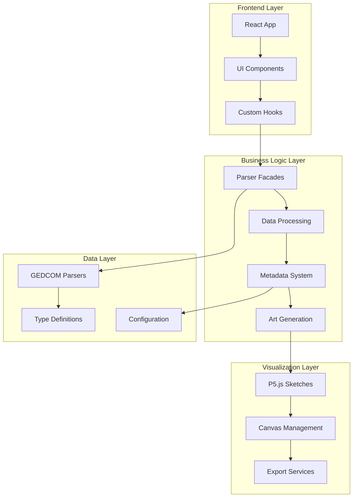

# Architecture Overview

## System Architecture

This document provides a comprehensive overview of the generation-art system architecture, including component responsibilities, data flow, and design patterns.

## High-Level Architecture



## Core Components

### 1. Parser Layer

#### `GedcomParserFacade` (Abstract Interface)

**Location**: `src/facades/GedcomParserFacade.ts`
**Purpose**: Provides a unified interface for different GEDCOM parsers
**Responsibilities**:

- Define common parser interface
- Abstract parser implementation details
- Enable parser switching

```typescript
interface GedcomParserFacade {
  parse(gedcomText: string): GedcomData;
}
```

#### `GedcomTsParserFacade` (Concrete Implementation)

**Purpose**: Wrapper for gedcom-ts library
**Features**:

- TypeScript-first approach
- AST-based parsing
- Comprehensive error handling
- Rich data extraction

#### `SimpleGedcomParserFacade` (Concrete Implementation)

**Purpose**: Custom parser for specific use cases
**Features**:

- Lightweight implementation
- Custom parsing logic
- Fallback option
- Performance optimization

### 2. Data Processing Layer

#### `augmentIndividuals.ts`

**Location**: `src/tasks/augmentIndividuals.ts`
**Purpose**: Enhance parsed data with computed properties
**Responsibilities**:

- Calculate generation depth
- Compute relationship metrics
- Add derived properties
- Validate data integrity

**Key Functions**:

```typescript
export function augmentIndividuals(
  individuals: Individual[],
  families: Family[],
): AugmentedIndividual[];
```

#### `metadata-extraction-config.ts`

**Location**: `src/metadata/metadata-extraction-config.ts`
**Purpose**: Define and configure metadata extraction
**Responsibilities**:

- Define metadata field configurations
- Provide transformation functions
- Handle PII masking
- Validate metadata quality

**Key Features**:

- Configurable field definitions
- Pure transformation functions
- PII protection mechanisms
- Extensible architecture

#### `transformation-pipeline.ts`

**Location**: `src/metadata/transformation-pipeline.ts`
**Purpose**: Orchestrate data transformation pipeline
**Responsibilities**:

- Coordinate metadata extraction
- Apply PII masking
- Validate transformed data
- Handle transformation errors

### 3. Visualization Layer

#### `FamilyTreeSketch.ts`

**Location**: `src/sketches/FamilyTreeSketch.ts`
**Purpose**: P5.js sketch for family tree visualization
**Responsibilities**:

- Define rendering logic
- Map data to visual properties
- Handle user interactions
- Manage canvas state

**Key Functions**:

```typescript
export function createWebSketch(data: ArtData): p5;
export function createPrintSketch(data: ArtData): p5;
```

#### `ArtGenerator.tsx`

**Location**: `src/components/ArtGenerator.tsx`
**Purpose**: React component wrapper for P5.js
**Responsibilities**:

- Manage P5.js lifecycle
- Handle component mounting/unmounting
- Coordinate with React state
- Provide error boundaries

#### `useCanvasExport.ts`

**Location**: `src/hooks/useCanvasExport.ts`
**Purpose**: Custom hook for canvas export functionality
**Responsibilities**:

- Manage export state
- Handle export operations
- Provide export progress
- Error handling for exports

### 4. UI Layer

#### `GedcomLoader.tsx`

**Location**: `src/components/GedcomLoader.tsx`
**Purpose**: File upload and loading component
**Responsibilities**:

- Handle file selection
- Validate file format
- Show loading states
- Display error messages

#### `FramedArtwork.tsx`

**Location**: `src/components/FramedArtwork.tsx`
**Purpose**: Art display wrapper with metadata
**Responsibilities**:

- Provide visual frame
- Display title and metadata
- Integrate export controls
- Handle layout management

#### `Footer.tsx`

**Location**: `src/components/Footer.tsx`
**Purpose**: Export and control interface
**Responsibilities**:

- Display canvas dimensions
- Provide export buttons
- Show status messages
- Handle user interactions

### 5. Services Layer

#### `ExportService.ts`

**Location**: `src/services/ExportService.ts`
**Purpose**: Handle file export operations
**Responsibilities**:

- Generate PNG exports
- Create print-ready versions
- Manage file downloads
- Handle export errors

#### `CanvasFactory.ts`

**Location**: `src/utils/CanvasFactory.ts`
**Purpose**: Utility functions for canvas management
**Responsibilities**:

- Create temporary canvases
- Clean up resources
- Manage canvas lifecycle
- Handle canvas operations

## Data Flow Patterns

### 1. Unidirectional Data Flow

```
File Upload → Parser → Data Enhancement → Metadata → Art Generation → Display
```

### 2. Component Communication

- **Props Down**: Data flows from parent to child components
- **Events Up**: User interactions bubble up through callbacks
- **Context**: Shared state managed through React Context
- **Custom Hooks**: Business logic encapsulated in reusable hooks

### 3. Error Handling Strategy

- **Boundary Pattern**: Error boundaries catch and handle errors
- **Graceful Degradation**: System continues with partial data
- **User Feedback**: Clear error messages and recovery options
- **Logging**: Comprehensive error logging for debugging

## Design Patterns

### 1. Facade Pattern

**Used in**: `GedcomParserFacade`
**Purpose**: Simplify complex parser interfaces
**Benefits**:

- Unified API for different parsers
- Easy parser switching
- Reduced coupling

### 2. Factory Pattern

**Used in**: `CanvasFactory`, sketch creation
**Purpose**: Create objects without specifying exact classes
**Benefits**:

- Flexible object creation
- Configuration-based instantiation
- Testability

### 3. Pipeline Pattern

**Used in**: `transformation-pipeline.ts`
**Purpose**: Process data through multiple stages
**Benefits**:

- Modular processing
- Easy to extend
- Clear data flow

### 4. Hook Pattern

**Used in**: `useCanvasExport`, `useGedcomData`
**Purpose**: Encapsulate stateful logic
**Benefits**:

- Reusable logic
- Clean component code
- Easy testing

## Type System

### Core Types

```typescript
// Base data structures
interface Individual {
  id: string; // GEDCOM: @XREF@ (Individual ID)
  name: string; // GEDCOM: NAME tag
  birth?: { date?: string; place?: string }; // GEDCOM: BIRT.DATE, BIRT.PLAC
  death?: { date?: string; place?: string }; // GEDCOM: DEAT.DATE, DEAT.PLAC
  parents: string[]; // GEDCOM: FAMC (Family as Child) references
  spouses: string[]; // GEDCOM: FAMS (Family as Spouse) references
  children: string[]; // GEDCOM: CHIL tags in FAM records
  siblings: string[]; // GEDCOM: Derived from FAMC siblings
}

// Enhanced data structures
interface AugmentedIndividual extends Individual {
  generation?: number | null; // GEDCOM: Computed from FAMC hierarchy
  relativeGenerationValue?: number; // GEDCOM: Computed position in tree
}

// Metadata structures
interface IndividualMetadata {
  lifespan?: number; // GEDCOM: Derived from BIRT.DATE and DEAT.DATE
  isAlive?: boolean; // GEDCOM: Derived from presence/absence of DEAT tag
  birthMonth?: number; // GEDCOM: Derived from BIRT.DATE
  zodiacSign?: string; // GEDCOM: Derived from BIRT.DATE
}
```

### Type Safety Features

- **Strict TypeScript**: Full type checking enabled
- **Interface Contracts**: Clear data structure definitions
- **Type Predicates**: Runtime type validation
- **Generic Types**: Reusable type definitions

## Configuration Management

### Environment Configuration

```typescript
// src/constants.ts
export const CANVAS_DIMENSIONS = {
  web: { width: 800, height: 600 },
  print: { width: 2400, height: 1800 },
};

export const PRINT_SETTINGS = {
  scaleFactor: 3,
  dpi: 300,
  filename: 'family-tree-print.png',
};
```

### Metadata Configuration

```typescript
// src/metadata/metadata-extraction-config.ts
export const metadataExtractionConfig: Record<string, MetadataFieldConfig> = {
  lifespan: {
    fieldName: 'lifespan',
    category: 'Individual',
    scope: 'individual',
    dataType: 'float',
    piiLevel: 'high',
    // ... configuration
  },
};
```

## Performance Considerations

### 1. Memory Management

- **Lazy Loading**: Load data on demand
- **Garbage Collection**: Proper cleanup of P5.js instances
- **Data Caching**: Cache parsed data to avoid re-parsing

### 2. Rendering Optimization

- **Canvas Batching**: Batch rendering operations
- **Off-screen Rendering**: Use off-screen canvases for exports
- **Throttling**: Limit frequent updates

### 3. File Processing

- **Chunked Processing**: Process large files in chunks
- **Progress Tracking**: Show progress for long operations
- **Background Processing**: Use Web Workers for heavy tasks

## Security & Privacy

### 1. Data Protection

- **PII Masking**: Transform sensitive data
- **Input Validation**: Validate all user inputs
- **File Scanning**: Check uploaded files for malicious content

### 2. Export Security

- **Data Sanitization**: Remove sensitive data from exports
- **Format Validation**: Ensure safe export formats
- **Access Control**: Limit export capabilities

## Testing Strategy

### 1. Unit Testing

- **Component Tests**: Test individual components
- **Function Tests**: Test pure functions
- **Hook Tests**: Test custom hooks

### 2. Integration Testing

- **Pipeline Tests**: Test data flow through pipeline
- **Parser Tests**: Test parser integration
- **Export Tests**: Test export functionality

### 3. Visual Testing

- **Canvas Tests**: Test rendering output
- **Export Tests**: Test export quality
- **Responsive Tests**: Test different screen sizes

## Deployment Architecture

### 1. Build Process

- **Vite**: Fast development and optimized builds
- **TypeScript**: Type checking and compilation
- **ESLint**: Code quality enforcement

### 2. Distribution

- **Static Assets**: Optimized for CDN delivery
- **Bundle Splitting**: Separate vendor and app bundles
- **Tree Shaking**: Remove unused code

## Future Architecture Considerations

### 1. Scalability

- **Web Workers**: Move heavy processing to background
- **Service Workers**: Cache and offline support
- **Progressive Loading**: Load data incrementally

### 2. Extensibility

- **Plugin System**: Support for custom visualizations
- **Configuration API**: Runtime configuration changes
- **Custom Parsers**: Support for additional data formats

### 3. Collaboration

- **Real-time Updates**: Live data synchronization
- **Shared State**: Collaborative editing
- **Version Control**: Track data changes
