# Data Flow: GEDCOM to Generative Art

## Overview

This diagram shows the complete data flow from GEDCOM file upload to final rendered artwork, including all transformation stages and component interactions.

## High-Level Data Flow

```mermaid
graph TD
    A["📁 GEDCOM File<br/>.ged format"] --> B["🖥️ CLI Build Process<br/>build-gedcom.ts"]
    B --> C["🔍 File Validation<br/>Error handling"]
    C --> D["📝 Raw GEDCOM Text<br/>String content"]
    D --> E["🔧 Parser Selection<br/>GedcomParserFacade"]
    E --> F["⚙️ Parser Implementation<br/>gedcom-ts or SimpleGedcomParser"]
    F --> G["📊 Structured Data<br/>Individual and Family objects"]
    G --> H["🔄 Data Enhancement<br/>build-gedcom.ts"]
    H --> I["📈 Metadata Extraction<br/>metadata-extraction-config.ts"]
    I --> J["🔒 PII Masking<br/>transformation-pipeline.ts"]
    J --> K["💾 Generated JSON<br/>generated/parsed/ (git ignored)"]
    K --> L["🎨 Art Generation<br/>FamilyTreeSketch.ts"]
    L --> M["🖼️ Canvas Rendering<br/>P5.js instance"]
    M --> N["💻 Web Display<br/>ArtGenerator.tsx"]
    M --> O["📥 Export PNG<br/>useCanvasExport.ts"]
    M --> P["🖨️ Print Export<br/>ExportService.ts"]

    style A fill:#e1f5fe
    style M fill:#c8e6c9
    style N fill:#fff3e0
    style O fill:#fff3e0
```

## Detailed Component Flow

## Data Transformation Stages

### Stage 1: CLI Build Process

- **Input**: GEDCOM file (.ged format)
- **Process**: CLI build, validation, text extraction
- **Output**: Raw GEDCOM text string
- **Components**: `build-gedcom.ts`, file validation logic

### Stage 2: Parsing

- **Input**: Raw GEDCOM text
- **Process**: Parse GEDCOM structure into structured data
- **Output**: `Individual[]` and `Family[]` objects
- **Components**: `GedcomParserFacade`, parser implementations

### Stage 3: Data Enhancement

- **Input**: Basic Individual/Family objects
- **Process**: Add computed properties (generation, relationships)
- **Output**: `AugmentedIndividual[]` with additional metadata
- **Components**: `build-gedcom.ts`, relationship calculators

### Stage 4: Metadata Extraction

- **Input**: Augmented individual data
- **Process**: Extract art-specific metadata (lifespan, zodiac, etc.)
- **Output**: Rich metadata objects
- **Components**: `metadata-extraction-config.ts`, transformation pipeline

### Stage 5: PII Masking

- **Input**: Metadata with potential PII
- **Process**: Apply privacy-preserving transformations
- **Output**: Masked metadata safe for visualization
- **Components**: `transformation-pipeline.ts`, masking functions

### Stage 6: Art Generation

- **Input**: Masked metadata and family relationships
- **Process**: Map data to visual properties, generate coordinates
- **Output**: P5.js sketch with rendering instructions
- **Components**: `FamilyTreeSketch.ts`, coordinate calculators

### Stage 7: Rendering

- **Input**: P5.js sketch configuration
- **Process**: Render to canvas, handle user interactions
- **Output**: Interactive web display or static image
- **Components**: `ArtGenerator.tsx`, `useCanvasExport.ts`

## Data Structures

For complete type definitions with GEDCOM property mappings, see **[Types Documentation](types.md)**.

### Data Flow Types

The data transformation pipeline uses these key types:

- **Input**: `string` (Raw GEDCOM text)
- **Parsed**: `Individual`, `Family` (Structured GEDCOM data)
- **Enhanced**: `AugmentedIndividual` (With metadata property containing non-PII computed data)
- **Output**: `AugmentedIndividual` (With art generation metadata)

### Key Transformations

1. **Raw GEDCOM** → **Parsed Objects**: GEDCOM tags mapped to TypeScript properties
2. **Parsed Objects** → **Augmented Objects**: Metadata property added with computed/transformed data
3. **Augmented Objects** → **LLM-Safe Data**: Only metadata property sent to external systems

See **[Types Documentation](types.md)** for detailed interface definitions and GEDCOM property mappings.

## Error Handling Flow

## Performance Considerations

### Memory Management

- **Large Files**: Process in chunks, implement pagination
- **Canvas Rendering**: Use off-screen canvases for exports
- **Data Caching**: Cache parsed data to avoid re-parsing

### Optimization Points

- **Parser Selection**: Choose parser based on file size
- **Lazy Loading**: Load metadata on demand
- **Canvas Optimization**: Batch rendering operations

## Security & Privacy

### PII Protection

- **Data Masking**: Apply transformations to sensitive data
- **Export Controls**: Limit data in exported files
- **Access Controls**: Validate file sources

### File Validation

- **Format Validation**: Ensure valid GEDCOM format
- **Size Limits**: Prevent oversized file uploads
- **Content Scanning**: Check for malicious content

## Future Enhancements

### Planned Improvements

- **Streaming Parsing**: Handle very large files
- **Real-time Updates**: Live data updates
- **Advanced Visualizations**: Multiple art styles
- **Collaborative Features**: Shared family trees

### Scalability Considerations

- **Web Workers**: Move heavy processing to background
- **Service Workers**: Cache parsed data
- **Progressive Loading**: Load data incrementally
