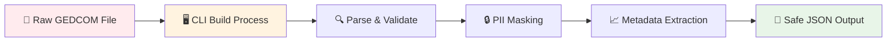
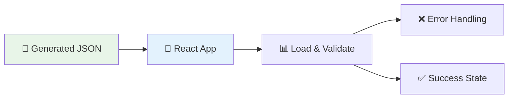
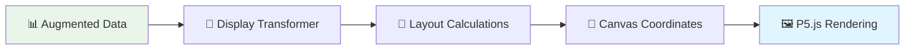

# Data Flow Stages & Security Boundaries

This document clearly explains the **3-stage data flow** and **security boundaries** in the Generation Art application.

## 🛡️ Security Overview

```
┌─────────────────────────────────────────────────────────────────┐
│                        SECURITY BOUNDARIES                      │
├─────────────────────────────────────────────────────────────────┤
│  🖥️  STAGE 1: CLI-ONLY (LOCAL, PRIVATE)                        │
│  └─ Never leaves developer machine                              │
│                                                                 │
│  🎨  STAGE 2 & 3: CLIENT-SIDE (PUBLIC)                         │
│  └─ Loads pre-processed, PII-safe data                         │
└─────────────────────────────────────────────────────────────────┘
```

## 📊 Three-Stage Data Flow

### **Stage 1: Data Import & PII Masking** 🖥️

**Location**: `src/cli/`  
**Environment**: CLI-only, local, private  
**Purpose**: Import raw GEDCOM data and create PII-safe metadata



**What happens here:**

- ✅ **Raw GEDCOM parsing** - Extract all personal data
- ✅ **PII masking** - Transform sensitive data for privacy
- ✅ **Metadata extraction** - Create art-specific computed data
- ✅ **Local-only processing** - Never sent to remote servers
- ✅ **Git-ignored output** - Generated files stay local

**Output**: `generated/parsed/*-augmented.json` (contains both raw data + PII-safe metadata)

---

### **Stage 2: Data Loading & Error Handling** 🎨

**Location**: `src/client/data-loading/`  
**Environment**: Client-side, public  
**Purpose**: Load pre-processed JSON and handle errors gracefully



**What happens here:**

- ✅ **JSON loading** - Fetch pre-processed data from `generated/` directory
- ✅ **Error handling** - Graceful fallbacks for missing/corrupt files
- ✅ **Data validation** - Ensure JSON structure is correct
- ✅ **Loading states** - User feedback during data loading

**Input**: `generated/parsed/*-augmented.json`  
**Output**: Validated `AugmentedIndividual[]` data

---

### **Stage 3: Display Data & Canvas Rendering** 🎨

**Location**: `src/client/display/`  
**Environment**: Client-side, public  
**Purpose**: Transform metadata into canvas-specific layout data



**What happens here:**

- ✅ **Display data creation** - Map metadata to canvas layout
- ✅ **Coordinate calculations** - Position nodes and edges
- ✅ **Animation data** - Prepare data for visual effects
- ✅ **Canvas rendering** - Generate final artwork

**Input**: `AugmentedIndividual[]` with metadata  
**Output**: Canvas-ready display data

---

## 🔒 Security Boundaries

### **Stage 1: CLI-Only Zone** 🖥️

```
┌─────────────────────────────────────────────────────────────────┐
│                        CLI-ONLY ZONE                            │
│                    (LOCAL, PRIVATE, SECURE)                     │
├─────────────────────────────────────────────────────────────────┤
│  📁 Raw GEDCOM files (contain PII)                             │
│  🖥️ CLI build process (local processing)                       │
│  🔒 PII masking (privacy protection)                           │
│  📈 Metadata extraction (PII-safe computed data)               │
│  💾 Generated JSON (git-ignored, local only)                   │
└─────────────────────────────────────────────────────────────────┘
```

**Security Features:**

- ✅ **No network transmission** - All processing local
- ✅ **Git-ignored output** - Generated files never committed
- ✅ **PII masking** - Sensitive data transformed
- ✅ **CLI-only access** - No web interface to raw data

### **Stage 2 & 3: Client-Side Zone** 🎨

```
┌─────────────────────────────────────────────────────────────────┐
│                      CLIENT-SIDE ZONE                           │
│                    (PUBLIC, SAFE DATA)                          │
├─────────────────────────────────────────────────────────────────┤
│  💾 Pre-processed JSON (PII masked)                            │
│  🎨 React app (public interface)                               │
│  📊 Data loading & validation                                  │
│  🎯 Display data transformation                                │
│  🖼️ Canvas rendering (final artwork)                           │
└─────────────────────────────────────────────────────────────────┘
```

**Security Features:**

- ✅ **Pre-processed data** - Only safe, masked data loaded
- ✅ **No raw GEDCOM access** - Can't access original files
- ✅ **Metadata only** - PII-safe computed values
- ✅ **Public interface** - Safe for web deployment

---

## 📁 File Organization

### **New Structure** (Clear Separation)

```
src/
├── cli/                          # 🖥️ STAGE 1: CLI-only
│   ├── import/                   # Data import & PII masking
│   │   ├── build-gedcom.ts       # Main CLI script
│   │   ├── parseGedcom.ts        # Basic parsing
│   │   └── README.md             # CLI usage docs
│   └── metadata/                 # Metadata extraction
│       ├── extraction-config.ts
│       ├── transformation-pipeline.ts
│       └── README.md
├── client/                       # 🎨 STAGE 2 & 3: Client-side
│   ├── data-loading/             # STAGE 2: JSON loading
│   │   ├── hooks/
│   │   │   └── useGedcomData.ts
│   │   ├── types/
│   │   │   └── gedcom.ts
│   │   └── README.md
│   └── display/                  # STAGE 3: Canvas rendering
│       ├── sketches/
│       │   └── FamilyTreeSketch.ts
│       ├── layout/
│       │   └── display-data.ts   # NEW: Canvas layout data
│       ├── components/
│       │   ├── ArtGenerator.tsx
│       │   └── FramedArtwork.tsx
│       └── README.md
├── shared/                       # 🔄 Shared utilities
│   ├── types/
│   ├── constants.ts
│   └── utils/
└── README.md                     # Main data flow documentation
```

### **Directory Responsibilities**

#### **`src/cli/`** 🖥️

- **Purpose**: CLI-only processing, never runs in browser
- **Security**: Contains all PII-sensitive operations
- **Input**: Raw GEDCOM files
- **Output**: Processed JSON with PII-safe metadata

#### **`src/client/`** 🎨

- **Purpose**: Browser-side application code
- **Security**: Only loads pre-processed, safe data
- **Input**: Generated JSON files
- **Output**: User interface and visualizations

#### **`src/shared/`** 🔄

- **Purpose**: Code used by both CLI and client
- **Security**: No PII, only safe types and utilities
- **Examples**: Type definitions, constants, utility functions

---

## 🚀 Usage Examples

### **Stage 1: CLI Processing** (Developer Only)

```bash
# Process GEDCOM files locally
pnpm build:gedcom

# Output: generated/parsed/*-augmented.json (git-ignored)
```

### **Stage 2: Data Loading** (Client-Side)

```typescript
// Load pre-processed, safe data
const { data, loading, error } = useGedcomData({
  jsonFile: 'generated/parsed/kennedy-augmented.json',
});
```

### **Stage 3: Display Rendering** (Client-Side)

```typescript
// Transform metadata to canvas layout
const displayData = createDisplayData(augmentedIndividuals);
// Render with P5.js
const sketch = createWebSketch(displayData, width, height);
```

---

## 🔍 Key Benefits

### **For Developers:**

- ✅ **Clear separation** - Obvious which code runs where
- ✅ **Security boundaries** - No accidental PII exposure
- ✅ **Maintainable** - Each stage has clear responsibilities
- ✅ **Testable** - Can test each stage independently

### **For Security:**

- ✅ **PII isolation** - Raw data never leaves local machine
- ✅ **Git safety** - Generated files never committed
- ✅ **Client safety** - Only pre-processed data loaded
- ✅ **Clear boundaries** - Impossible to accidentally expose PII

### **For Users:**

- ✅ **Fast loading** - Pre-processed data loads quickly
- ✅ **Reliable** - Graceful error handling
- ✅ **Secure** - No personal data in public interface
- ✅ **Beautiful** - Rich metadata enables great visualizations

---

## 🎯 Next Steps

1. **Create Stage 3 display data layer** - `src/client/display/layout/display-data.ts`
2. **Add README files** in each directory explaining responsibilities
3. **Update import paths** throughout the codebase
4. **Create migration guide** for existing code
5. **Add comprehensive tests** for each stage

This structure makes it **impossible** to accidentally expose PII while providing a **clear, maintainable** codebase for developers! 🛡️
