# Data Flow

## Overview

3-stage pipeline that separates PII processing from visualization for privacy and security.

```mermaid
graph LR
    A[📁 GEDCOM] --> B[🖥️ CLI: Parse & Mask]
    B --> C[💾 JSON: Safe Data]
    C --> D[🎨 Client: Visualize]
    D --> E[🖼️ Canvas: Export]

    style A fill:#ffebee
    style C fill:#e8f5e8
    style E fill:#fff3e0
```

## Security Boundaries

> **🛡️ SECURITY BOUNDARIES**
>
> **🖥️ STAGE 1: CLI-ONLY (LOCAL, PRIVATE)**  
> └─ Never leaves developer machine
>
> **🎨 STAGE 2 & 3: CLIENT-SIDE (PUBLIC)**  
> └─ Loads pre-processed, PII-safe data

## Stage 1: CLI Processing 🖥️

**Purpose**: Parse GEDCOM + extract PII-safe metadata  
**Location**: `src/cli/`  
**Security**: Local only, never transmitted

```mermaid
graph LR
    A[📁 GEDCOM File] --> B[🔍 Parse & Validate]
    B --> C[🔒 PII Masking]
    C --> D[📈 Metadata Extraction]
    D --> E[💾 Safe JSON Output]

    style A fill:#ffebee
    style E fill:#e8f5e8
```

**Output**: `generated/parsed/*-augmented.json` (git-ignored)

## Stage 2: Data Loading 🎨

**Purpose**: Load pre-processed JSON + handle errors  
**Location**: `src/client/data-loading/`  
**Security**: Public, safe data only

```mermaid
graph LR
    A[💾 Generated JSON] --> B[📊 Load & Validate]
    B --> C[❌ Error Handling]
    B --> D[✅ Success State]

    style A fill:#e8f5e8
    style D fill:#c8e6c9
```

**Input**: `generated/parsed/*-augmented.json`  
**Output**: Validated `AugmentedIndividual[]`

## Stage 3: Visualization 🎨

**Purpose**: Transform metadata → canvas layout  
**Location**: `src/client/display/`  
**Security**: Public, safe data only

```mermaid
graph LR
    A[📊 Augmented Data] --> B[📐 Layout Calculations]
    B --> C[🎯 Canvas Coordinates]
    C --> D[🖼️ P5.js Rendering]

    style A fill:#e8f5e8
    style D fill:#e1f5fe
```

**Input**: `AugmentedIndividual[]`  
**Output**: Canvas rendering + exports

## Data Structures

| Stage | Input          | Output             | Key Types                                     |
| ----- | -------------- | ------------------ | --------------------------------------------- |
| **1** | GEDCOM file    | JSON with metadata | `Individual`, `Family`, `AugmentedIndividual` |
| **2** | Generated JSON | Validated data     | `AugmentedIndividual[]`                       |
| **3** | Augmented data | Canvas layout      | `DisplayData`, `CanvasCoordinates`            |

## Error Handling

## Key Files

- **CLI**: `src/cli/import/build-gedcom.ts`
- **Parsing**: `src/cli/parsers/SimpleGedcomParser.ts`
- **Metadata**: `src/cli/metadata/transformation-pipeline.ts`
- **Loading**: `src/client/data-loading/hooks/useGedcomData.ts`
- **Display**: `src/client/display/FamilyTreeSketch.ts`
