# Data Flow

## Overview

3-stage pipeline that separates PII processing from visualization for privacy and security.

```mermaid
graph LR
    A[📁 GEDCOM] --> B[🖥️ CLI: Parse & Mask]
    B --> C[💾 JSON: Safe Data]
    C --> D[🎨 Client: Visualize]
    D --> E[🖼️ Canvas: Export]

    style A fill:#ffebee
    style C fill:#e8f5e8
    style E fill:#fff3e0
```

## Security Boundaries

> **🛡️ SECURITY BOUNDARIES**
>
> **🖥️ STAGE 1: CLI-ONLY (LOCAL, PRIVATE)**  
> └─ Never leaves developer machine
>
> **🎨 STAGE 2 & 3: CLIENT-SIDE (PUBLIC)**  
> └─ Loads pre-processed, PII-safe data

## Stage 1: CLI Processing 🖥️

**Purpose**: Parse GEDCOM + generate dual data structure (full + LLM-ready)  
**Location**: `src/cli/`  
**Security**: Local only, never transmitted

```mermaid
graph LR
    A[📁 GEDCOM File] --> B[🔍 Parse & Validate]
    B --> C[📈 Comprehensive Metadata Analysis]
    C --> D[🔒 PII Stripping for LLM]
    D --> E[💾 Dual JSON Output]

    style A fill:#ffebee
    style E fill:#e8f5e8
```

**Output**:

- `generated/parsed/*.json` (full data with metadata)
- `generated/parsed/*-llm.json` (PII-stripped for LLM)
- `generated/parsed/*-stats.json` (processing statistics)

## Stage 2: Data Loading 🎨

**Purpose**: Load dual data structure (full + LLM-ready) + handle errors  
**Location**: `src/client/data-loading/`  
**Security**: Public, safe data only

```mermaid
graph LR
    A[💾 Full JSON] --> B[📊 Load & Validate]
    A2[💾 LLM JSON] --> B
    B --> C[❌ Error Handling]
    B --> D[✅ Dual Data Structure]

    style A fill:#e8f5e8
    style A2 fill:#e8f5e8
    style D fill:#c8e6c9
```

**Input**:

- `generated/parsed/*.json` (full data)
- `generated/parsed/*-llm.json` (LLM-ready data)  
  **Output**: Validated `DualGedcomData` with `full` and `llm` properties

## Stage 3: Visualization 🎨

**Purpose**: Transform dual data → canvas layout  
**Location**: `src/client/display/`  
**Security**: Public, safe data only

```mermaid
graph LR
    A[📊 Full Data] --> B[📐 Layout Calculations]
    A2[🔒 LLM Data] --> C[🤖 LLM Analysis]
    B --> D[🎯 Canvas Coordinates]
    C --> D
    D --> E[🖼️ P5.js Rendering]

    style A fill:#e8f5e8
    style A2 fill:#fff3e0
    style E fill:#e1f5fe
```

**Input**: `DualGedcomData` (full + LLM-ready)  
**Output**: Canvas rendering + exports

## Data Structures

| Stage | Input           | Output              | Key Types                                |
| ----- | --------------- | ------------------- | ---------------------------------------- |
| **1** | GEDCOM file     | Dual JSON files     | `GedcomDataWithMetadata`, `LLMReadyData` |
| **2** | Dual JSON files | Validated dual data | `DualGedcomData`                         |
| **3** | Dual data       | Canvas layout       | `DisplayData`, `CanvasCoordinates`       |

## Error Handling

## Key Files

- **CLI**: `src/cli/import/build-gedcom.ts`
- **Parsing**: `src/cli/parsers/SimpleGedcomParser.ts`
- **Metadata**: `src/cli/metadata/transformation-pipeline.ts`
- **Loading**: `src/client/data-loading/hooks/useGedcomData.ts`
- **Display**: `src/client/display/FamilyTreeSketch.ts`
