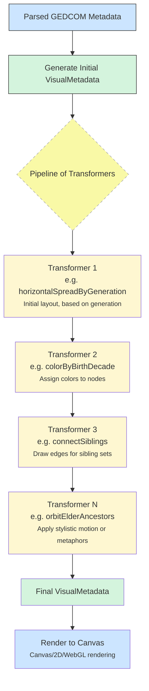

```mermaid
flowchart TD
A[Parsed GEDCOM Metadata] --> B[Generate Initial VisualMetadata]
B --> C{Pipeline of Transformers}
C --> C1[Transformer 1<br>e.g. horizontalSpreadByGeneration<br><small>Initial layout, based on generation</small>]
C1 --> C2[Transformer 2<br>e.g. colorByBirthDecade<br><small>Assign colors to nodes</small>]
C2 --> C3[Transformer 3<br>e.g. connectSiblings<br><small>Draw edges for sibling sets</small>]
C3 --> C4[Transformer N<br>e.g. orbitElderAncestors<br><small>Apply stylistic motion or metaphors</small>]
C4 --> D[Final VisualMetadata]

D --> E[Render to Canvas<br><small>Canvas/2D/WebGL rendering</small>]

style A fill:#cce5ff,stroke:#333,stroke-width:1px
style B fill:#d4f4dd,stroke:#333,stroke-width:1px
style C fill:#f9f9a6,stroke:#aaa,stroke-dasharray: 5 5
style C1 fill:#fef7d1
style C2 fill:#fef7d1
style C3 fill:#fef7d1
style C4 fill:#fef7d1
style D fill:#d4f4dd
style E fill:#cce5ff
```
