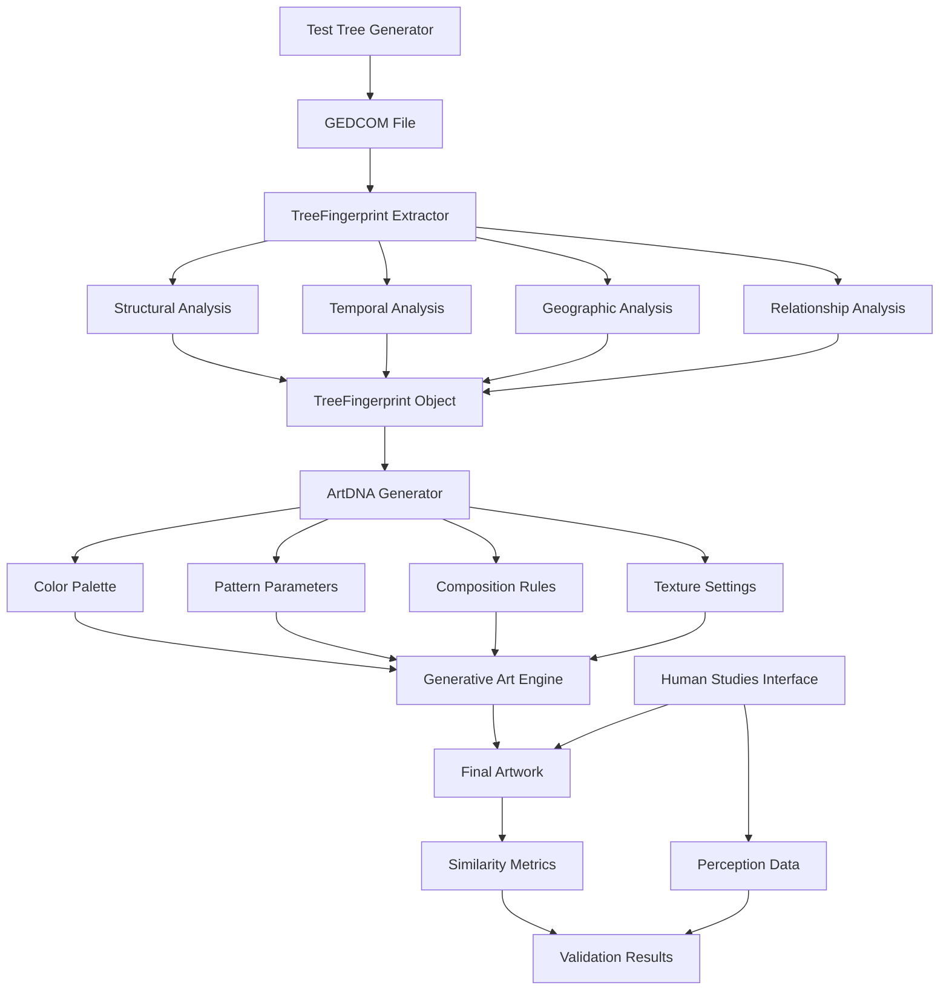

# Tree Uniqueness Validation Roadmap

## Executive Summary

### Why This Validation is Critical

The Generation Art project creates unique visual representations of family genealogy data from GEDCOM files. To ensure the project delivers on its core promise of **"unique art per unique family tree while maintaining consistent reproducibility"**, we must implement a comprehensive validation system that proves:

1. **Uniqueness**: Different family trees produce visually distinct artwork
2. **Consistency**: The same family tree always generates identical artwork
3. **Meaningfulness**: Visual differences correlate with genealogical differences
4. **Quality**: Generated art maintains aesthetic coherence across all tree types

Without this validation system, we cannot confidently claim our generative art truly reflects the uniqueness of each family's story. This roadmap outlines a systematic approach to build, test, and validate our core value proposition.

## Technical Approach

### High-Level Architecture

```
GEDCOM File → TreeFingerprint → ArtDNA → Generative Art
     ↓             ↓            ↓           ↓
 Validation ←→ Testing ←→ Metrics ←→ Human Studies
```

#### Core Components

1. **TreeFingerprint System** - Extracts unique characteristics from GEDCOM data

   - Structural patterns (family sizes, generation depths)
   - Temporal signatures (date ranges, lifespans)
   - Geographic markers (place frequencies, migration patterns)
   - Relationship complexities (adoption, remarriage patterns)

2. **ArtDNA Mapping** - Deterministic conversion from tree characteristics to visual parameters

   - Color palettes derived from geographic data
   - Pattern complexity based on family density
   - Composition layout influenced by generational structure
   - Texture scales mapped to temporal spans

3. **Validation Framework** - Comprehensive testing and measurement system
   - Automated similarity metrics for visual comparison
   - Statistical significance testing for uniqueness claims
   - Human perception studies for validation
   - Performance benchmarking and regression testing

### Data Flow Architecture



## Implementation Phases

### Phase 1: Foundation Systems (Weeks 1-4)

**Timeline**: 4 weeks  
**Priority**: Critical Path

#### Week 1-2: TreeFingerprint System

- **Issue #1**: Implement TreeFingerprint interface and extraction logic
- Define comprehensive fingerprinting data structures
- Build extraction algorithms for all GEDCOM features
- Implement deterministic hashing for reproducible seeds
- Create utility functions for statistical analysis

#### Week 3-4: Test Data Generation

- **Issue #2**: Build comprehensive GEDCOM test data generator
- Generate 10-15 diverse test families covering all complexity scenarios
- Ensure valid GEDCOM 5.5.1 format compliance
- Create edge cases and cultural variations
- Build automated test data pipeline

**Phase 1 Deliverables**:

- Working TreeFingerprint extraction system
- Comprehensive test GEDCOM dataset
- Deterministic fingerprint generation
- Basic validation that identical trees produce identical fingerprints

### Phase 2: Art Generation & Metrics (Weeks 5-8)

**Timeline**: 4 weeks  
**Priority**: Core Functionality

#### Week 5-6: ArtDNA Mapping System

- **Issue #4**: Map tree fingerprints to consistent visual parameters
- Design deterministic ArtDNA generation
- Implement hash-based color palette creation
- Map genealogical patterns to visual parameters
- Ensure aesthetic coherence across all tree types

#### Week 7-8: Visual Similarity Metrics

- **Issue #3**: Implement art comparison and similarity measurement
- Build color histogram comparison functions
- Implement structural and compositional analysis
- Create perceptual hashing for efficient comparisons
- Develop weighted similarity scoring system

**Phase 2 Deliverables**:

- Deterministic ArtDNA generation system
- Quantitative visual similarity measurement tools
- Initial validation of same-tree consistency
- Baseline measurements for inter-tree distinction

### Phase 3: Validation & Human Studies (Weeks 9-12)

**Timeline**: 4 weeks  
**Priority**: Validation & Quality Assurance

#### Week 9-10: Automated Testing Suite

- **Issue #5**: Build comprehensive validation test framework
- Implement intra-tree consistency validation
- Build inter-tree distinction testing
- Create parameter sensitivity analysis
- Add performance benchmarking and CI/CD integration

#### Week 11-12: Human Perception Studies

- **Issue #6**: Create tools for human validation of art uniqueness
- Build blind identification test interface
- Implement A/B comparison utilities
- Create data collection and analysis tools
- Conduct human perception studies with statistical analysis

**Phase 3 Deliverables**:

- Complete automated testing suite with CI/CD integration
- Human perception study tools and interfaces
- Statistical validation of uniqueness claims
- Comprehensive documentation and results

## Success Metrics

### Quantitative Goals

#### Consistency Metrics (Same Tree → Same Art)

- **Target**: 100% identical output for identical input
- **Measurement**: Pixel-perfect comparison of generated artwork
- **Validation**: Automated tests run on every commit

#### Uniqueness Metrics (Different Trees → Different Art)

- **Target**: <30% similarity score between different family trees
- **Measurement**: Weighted visual similarity metrics
- **Validation**: Statistical significance testing (p < 0.001)

#### Human Perception Validation

- **Target**: >80% accuracy in blind tree identification from artwork
- **Measurement**: Human study with minimum 50 participants
- **Validation**: Statistical analysis of identification rates

#### Performance Benchmarks

- **Fingerprint Extraction**: <500ms per GEDCOM file
- **Art Generation**: <2s per artwork
- **Similarity Analysis**: <100ms per comparison
- **Test Suite Execution**: <30s for complete validation

### Qualitative Goals

#### Aesthetic Coherence

- Generated art maintains visual appeal across all tree types
- Color palettes remain harmonious regardless of input data
- Compositions follow design principles and avoid chaotic output

#### Meaningful Correlation

- Visual differences correlate with genealogical significance
- Similar families produce similar art styles
- Geographic and cultural markers translate to recognizable visual patterns

## Risk Mitigation

### Technical Risks

#### Risk: Insufficient Visual Distinction Between Trees

**Probability**: Medium | **Impact**: High
**Mitigation Strategy**:

- Implement multiple validation approaches (automated + human)
- Create sensitivity analysis to identify critical differentiation factors
- Build iterative refinement process based on validation results
- Maintain fallback random elements if deterministic mapping insufficient

#### Risk: Deterministic Generation Produces Unaesthetic Results

**Probability**: Medium | **Impact**: Medium  
**Mitigation Strategy**:

- Implement aesthetic constraint systems within deterministic framework
- Create multi-stage validation including human aesthetic assessment
- Build parameter tuning system with aesthetic quality metrics
- Maintain human oversight in art parameter mapping decisions

#### Risk: Performance Issues with Complex Trees

**Probability**: Low | **Impact**: Medium
**Mitigation Strategy**:

- Implement performance benchmarking in automated test suite
- Create optimization strategies for large family trees
- Build progressive enhancement for complex genealogical structures
- Establish maximum complexity thresholds with graceful degradation

### Process Risks

#### Risk: Human Studies Validation Fails to Confirm Uniqueness

**Probability**: Medium | **Impact**: High
**Mitigation Strategy**:

- Design multiple validation approaches (identification, similarity rating, A/B testing)
- Create iterative improvement process based on human feedback
- Implement statistical power analysis to ensure adequate sample sizes
- Build refinement pipeline for addressing human perception gaps

#### Risk: Test Data Insufficient to Cover Edge Cases

**Probability**: Low | **Impact**: Medium
**Mitigation Strategy**:

- Research comprehensive genealogical pattern databases
- Collaborate with genealogy experts for edge case identification
- Implement continuous test case expansion based on real-world usage
- Create community contribution system for additional test cases

## Future Enhancements

### Long-Term Vision (Beyond Initial Implementation)

#### Advanced Genealogical Intelligence

- **Machine Learning Integration**: Train models on genealogical patterns to enhance fingerprinting
- **Cultural Marker Detection**: Automatic identification of ethnic and cultural genealogical patterns
- **Historical Context Integration**: Incorporate historical events and migration patterns
- **DNA Data Integration**: Combine traditional genealogy with genetic inheritance patterns

#### Enhanced Art Generation

- **Multiple Art Styles**: Support for different artistic movements and styles per tree
- **Interactive Art**: Dynamic artwork that responds to user exploration
- **3D Visualizations**: Extend beyond 2D to sculptural and spatial representations
- **Animation Systems**: Time-based art showing family evolution over generations

#### Community and Sharing

- **Art Gallery Platform**: Community sharing of generated family art
- **Comparison Tools**: Side-by-side family tree art comparisons
- **Collaboration Features**: Multiple family branches contributing to single artwork
- **Educational Integration**: Tools for genealogy education and family history research

#### Research and Academic Applications

- **Genealogical Pattern Research**: Contribute to academic genealogy research
- **Population Studies**: Large-scale analysis of family patterns across cultures
- **Historical Migration Visualization**: Art-based representation of population movements
- **Cultural Preservation**: Visual documentation of family traditions and heritage

### Technical Evolution Roadmap

#### Year 1: Foundation (Current Roadmap)

- Complete tree uniqueness validation system
- Establish proven art generation pipeline
- Build comprehensive testing framework
- Validate core value proposition

#### Year 2: Enhancement & Scale

- Implement machine learning pattern recognition
- Add multiple art style support
- Build performance optimization for large datasets
- Create community platform for sharing

#### Year 3: Innovation & Research

- Integrate DNA and genetic data
- Develop 3D and interactive art generation
- Build educational and research tools
- Establish academic partnerships

## Cross-Referenced GitHub Issues

This roadmap directly addresses the following GitHub issues:

- **[Issue #1](../../issues/1)**: GEDCOM Fingerprinting System → Phase 1 (Weeks 1-2)
- **[Issue #2](../../issues/2)**: Test Tree Generator → Phase 1 (Weeks 3-4)
- **[Issue #3](../../issues/3)**: Visual Similarity Metrics → Phase 2 (Weeks 7-8)
- **[Issue #4](../../issues/4)**: Deterministic Art DNA System → Phase 2 (Weeks 5-6)
- **[Issue #5](../../issues/5)**: Automated Testing Suite → Phase 3 (Weeks 9-10)
- **[Issue #6](../../issues/6)**: Human Perception Study Tools → Phase 3 (Weeks 11-12)

Each issue includes detailed technical requirements, acceptance criteria, and implementation guidance. The roadmap provides the strategic context and sequencing for these tactical implementations.

---

**Document Status**: Draft v1.0  
**Last Updated**: December 2024  
**Next Review**: Weekly during implementation phases  
**Owner**: Generation Art Development Team
