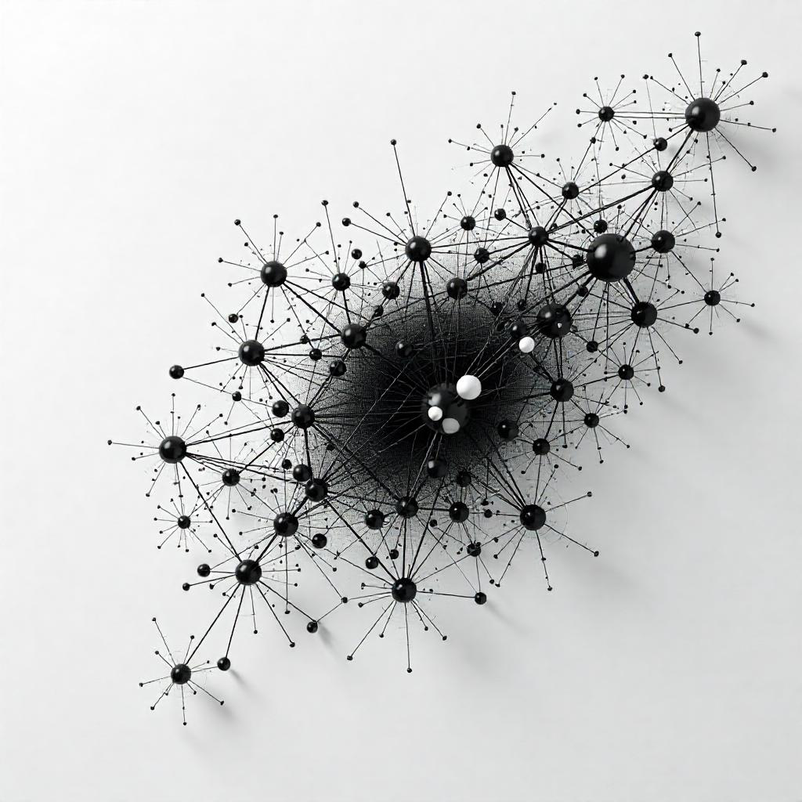

# generation-art 🎨

A web application that generates artistic visualizations from GEDCOM (Genealogical Data Communication) files, focusing on data enhancement and creative visualization rather than parsing. The project uses existing GEDCOM parsers and focuses on deriving meaningful numerical properties for generative art creation.

## 📚 About GEDCOM

GEDCOM (Genealogical Data Communication) is a standard file format for genealogical data. It's used to exchange genealogical data between different genealogy software. This project aims to be compatible with GEDCOM version 5.5.1, created by [Family Search](http://familysearch.org/). The published spec for version 5.5.1 is available, along with other official specifications, on the [Family Search site](https://www.familysearch.org/en/developers/docs/gedcom/) and has also been copied to this project's documentation folder [here](documents/ged551-5bac5e57fe88dd37df0e153d9c515335.pdf).

## ��️ Technology Stack

- TypeScript
- Canvas API
- Existing GEDCOM parser
- Modern build tools (Vite/Webpack)
- Testing framework (Jest/Vitest)

## 📝 Technical Notes

- Use TypeScript for type safety and better development experience
- Consider using `gedcom.js` or similar library for parsing
- Focus on Canvas API for visualization
- Consider using Web Workers for data processing
- Implement proper error handling for malformed GEDCOM files

## 🔍 Research & Resources

- GEDCOM 5.5.1 specification (stored in docs/)
- Existing GEDCOM parser libraries:
  - gedcom.js
  - gedcom-parse
  - family-tree-parser
- Canvas API documentation
- TypeScript best practices
- Generative art algorithms and patterns
